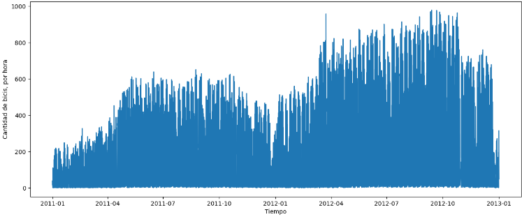

**BIKE SHARING**

INTRODUCTION

- I think after the last few years, we all agree that the situation of the environment we live in is complex and unpredictable due to numerous factors that we are all familiar with and affected by.

- We live in a time of change not only socially, technologically, and politically unstable. Above all, the latter is leading us to an unprecedented crisis of raw material costs, which only increases uncertainty towards one of humanity's great challenges at this stage, which is the transition to sustainability and energy efficiency.

- In a world where sustainability and health are becoming the main macro-trends associated with consumption, we find an increasingly concerned population about leading a healthy lifestyle, being environmentally sustainable, and exercising. And in fact, there is something that combines all these points that, as we have said, are very present today, and that is CYCLING.

- Within the world of bicycles, today we will focus on 'Bike Sharing'. The concept of 'Bike Sharing' is a kind of traditional bike rental where the membership, rental, and return process is done automatically. In other words, thanks to this system, a user can rent a bike at a particular location and leave it elsewhere. This makes it the FUTURE.
 

DATA PRESENTATION

- Today's study focuses on a real dataset with data from 2011 and 2012 from Capital Bikeshare, a well-known Bike Sharing chain in Washington DC, USA.

- And that's what we'll see today with this data: first a time series study of the 2011 and 2012 data with predictions using the Prophet library for 2013.

- Then we will carry out a modeling of the data both for categorical variables using CHI-SQUARED ANALYSIS.

- And for the numerical variables in the dataset, we will carry out treatment of the numerical variables (outliers, as we do not have nulls), study of collinearity of variables, and make and interpret several models applying different criteria (standardization and normalization).

The variables used in this dataset are:

    (DATETIME) Date: Relevant for carrying out the time series study. Which had to be modified to a datetime format.

    (CAT) Season: Spring, Summer, Autumn, and Winter.

    (CAT) Holiday: Yes or No, depending on whether it is a holiday or not.

    (CAT) Workingday: Yes or No, depending on whether it is a working day or not.

    (CAT) Weekday: The day of the week in question.

    (CAT) Weathertype: Categorical scale of 'Very Good', 'Good', 'Bad', and 'Very Bad'.

    (NUM) Temp: Real temperature in Celsius.

    (NUM) Atemp: Perceived temperature (real temp + humidity + wind) in Celsius.

    (NUM) Hum: Humidity range from 0 to 100.

    (NUM) Windspeed: Wind speed range from 0 to 67.

    (NUM) Casual: Count of bikes rented by casual customers.

    (NUM) Registered: Count of bikes rented by registered customers.

    (NUM) Cnt: Count of bikes rented (CASUAL + REGISTERED).

TIME SERIES STUDY

- The idea of the time series study is primarily to study trends and repetition patterns in bike rental trends.

*OBSERVATIONS OF TRENDS*

HOURLY BIKE TRENDS

DAILY BIKE TRENDS

- We see that in both years, bike rentals show significant increases in the summer months.

- The number of bikes rented in 2011 is lower than in 2012.

- We can make an observation/hypothesis that the summer months are also potentially impacted by a greater number of tourists as well as better weather.

BI-WEEKLY TRENDS

- Analyzing a random fortnight in spring, a season where temperature is not so determinant and there is not so much tourism (April 2011), we see how the curve of rented bikes follows a pattern of peaks at the end of the week.

- However, for summer, the peaks are not so marked, considering the peak on July 4th (national holiday). The weekday base is much higher, indicating the incidence of temperature and tourism.

*PROPHET FORECASTING PREDICTION*

- The conclusions drawn with Prophet are, firstly, that the base for 2013 will increase, considering that it has done so from 2011 to 2012.

- On a daily level, we see that the busiest days will be weekends, surprisingly, Thursdays' base is even higher than any weekend day, with Friday being the day with the highest number of bike rentals.

- On a monthly level, we see a very clear trend of increase in the summer months, which indicates that both temperature and the impact of tourism can be differentiating factors.

CORRELATION OF CATEGORICAL VARIABLES

- For the set of categorical variables, I first carried out a cleaning and standardization task and proceeded to study the correlation using the Chi-Squared method.

- In this case, my 'target' variable has been the study of the categorical temperature (Weathertype), which we know is highly related to the act of biking.

- I have carried out the correlation process between this variable both with the holiday variable and with the seasons of the year, obtaining in both cases a very low P-Value result which indicates the close relationship between them. This refutes what was seen in the previous point of time series, the seasonality, and also the relationship between sunny days on holidays, which has clearly helped bike rentals.

 
CORRELATION OF NUMERICAL VARIABLES

For the set of numerical variables, I decided to create two datasets and then see the performance metrics of my model.

- Alpha, in which I decide to keep the outliers.

- Beta in which I clean outliers by reducing percentiles to normalize the Hum and Windspeed variables.

    I decided not to touch the rest of the variables because I don't want to remove those values from my model as they represent real-world data.The outliers of Hum and Windspeed are minor and serve me to normalize these data.

For both data, I make a heatmap to study collinearity and remove the Atemp and Registered variables due to their high collinearity with the Temp and Cnt variables respectively.

In both cases, we first make a Train Test model and then proceed to apply the models.

*ALPHA MODEL*

- The model is 'decent' as R-Squared is greater than 0.5.

- Any p-value less than 0.05 tells you that that parameter is statistically significant, so we conclude that all are.
- At the coefficient level, we see that temperature and humidity, one positively and the other negatively, have a more relevant coefficient vs the constant, indicating that they are particularly indicative.

*BETA MODEL*

- The beta model with outliers is exactly the same as the alpha.
- Windspeed has a lower p-value in this model
- At the coefficient level, we see that windspeed also increases its relevance although it already is.

Since the results are very similar, I decided to base myself on the Alpha model to keep all the data, which I repeat, even though they are outliers, they are real and representative.

On the Alpha model, we will apply changes both in normalization and standardization to see the results, repeating the same Train and Test process.

*NORMALIZED ALPHA MODEL*

- The r2 of this normalized alpha model gives us a very high r2 of 0.8 which tells us that the model is very good.

- All p-values of the variables are equal to 0 which tells us that normalizing windspeed becomes even lower than in beta and alpha.

*STANDARDIZED ALPHA MODEL*

- The standardized alpha model does not show the same results of r2 or p-value as the normalized model.

CONCLUSION

As we can appreciate in the results of the models, the process of Bike-Sharing rental is highly correlated with environmental situations; it is evident, elements such as temperature, precipitation, or the day of the week play an important role in taking a bike or not.

In this case, we can see that we have variables that correlate positively and that in this case, they are very relevant in our target variable (cnt) like temperature. To a lesser extent, windspeed and casual users also positively correlate.

On the other hand, we see a negative impact correlation with the humidity variable. This tells us that with a greater increase in humidity, the number of bikes rented is lower.
